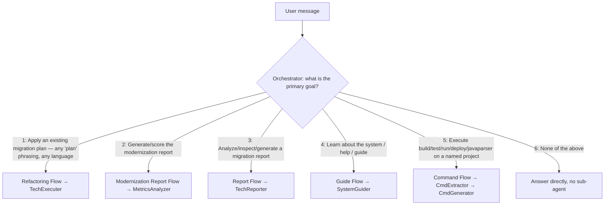

## Orchestrator Decision Routing — Diagram

```mermaid
graph TD
    A[User message] --> B{Orchestrator: what is the primary goal?}
    B -->|1: Apply an existing migration plan — any 'plan' phrasing, any language| D[Refactoring Flow → TechExecuter]
    B -->|2: Generate/score the modernization report| H[Modernization Report Flow → MetricsAnalyzer]
    B -->|3: Analyze/inspect/generate a migration report| C[Report Flow → TechReporter]
    B -->|4: Learn about the system / help / guide| F[Guide Flow → SystemGuider]
    B -->|5: Execute build/test/run/deploy/javaparser on a named project| E[Command Flow → CmdExtractor → CmdGenerator]
    B -->|6: None of the above| G[Answer directly, no sub-agent]
```
