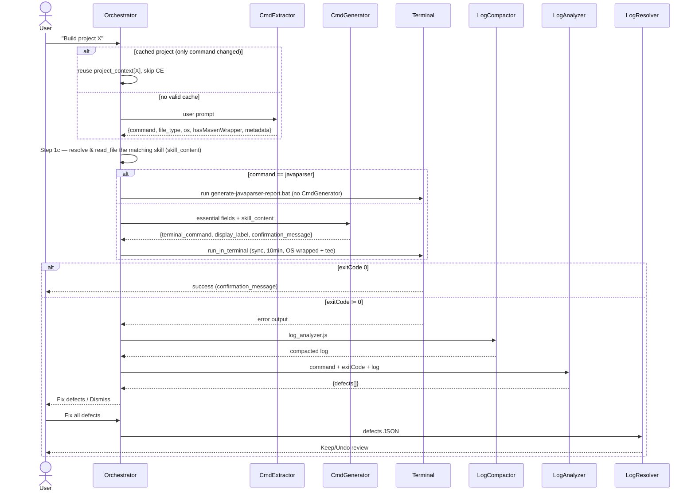

## Command Flow (build / test / run / package / compile / deploy / javaparser)

Triggered when the user asks to build, test, run, package, or generate a JavaParser AST report for a named project.

**Key mechanics:**
- **Session cache** (`project_context`): repeat commands on the same project skip re-extraction — only `command` is overwritten.
- **Step 1c (latency optimization):** the Orchestrator itself resolves and reads the skill file CommandGenerator would need, using the same routing table, and passes the raw text as `skill_content` — CommandGenerator then skips its own `read_file` call entirely.
- **JavaParser short-circuit:** `command == "javaparser"`/`"generate_javaparser_report"` skips CommandGenerator and runs `generate-javaparser-report.bat` directly (Windows-only). Produces `business-ast-report.json` + `dependency-tree.txt`.
- **On failure:** filtered logs (errors/stack traces/last 150 lines) go to LogAnalyzer → defect list → user confirmation gate → LogResolver batch-fixes.
