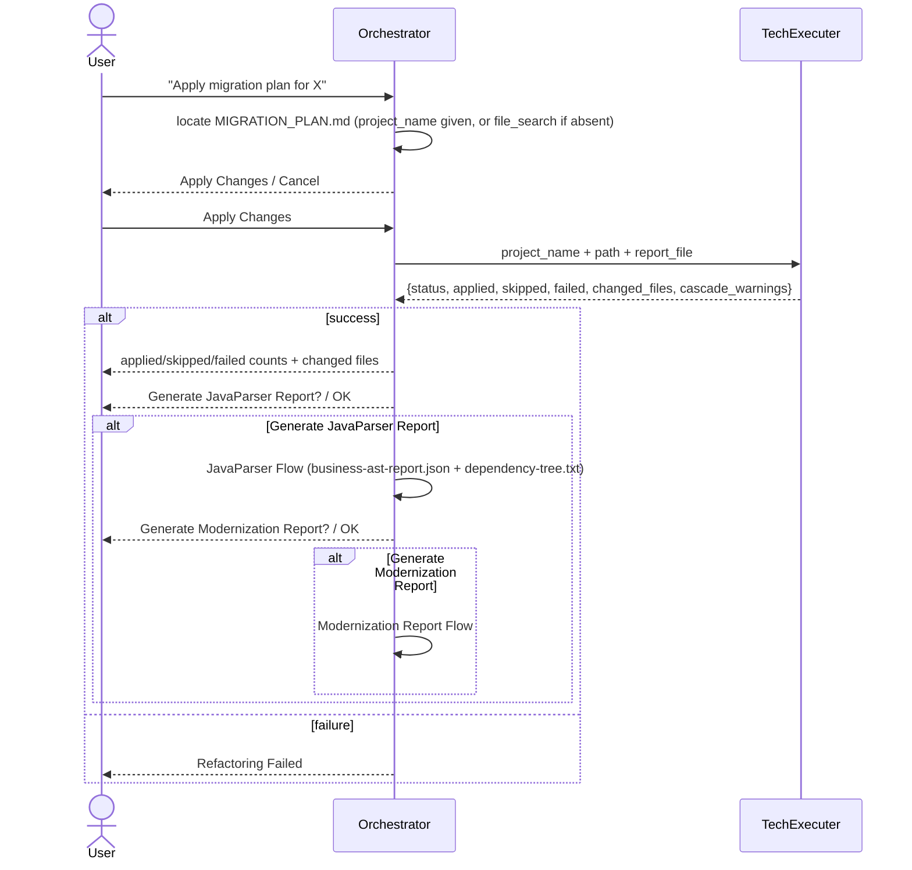

## Refactoring Flow (apply the plan / implement changes)

Triggered when the user asks to apply a previously generated migration plan. ⛔ Any phrasing mentioning "plan" (in any language) routes here — highest routing priority.

The post-apply JavaParser + Modernization Report steps are optional, user-confirmed follow-ons — they never run automatically after a successful apply.
