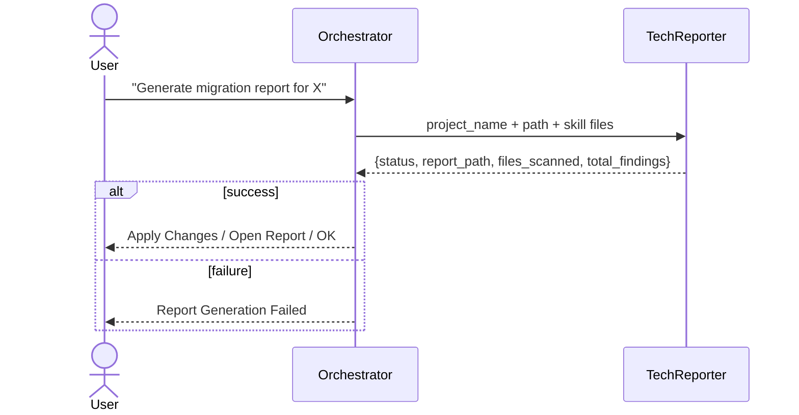
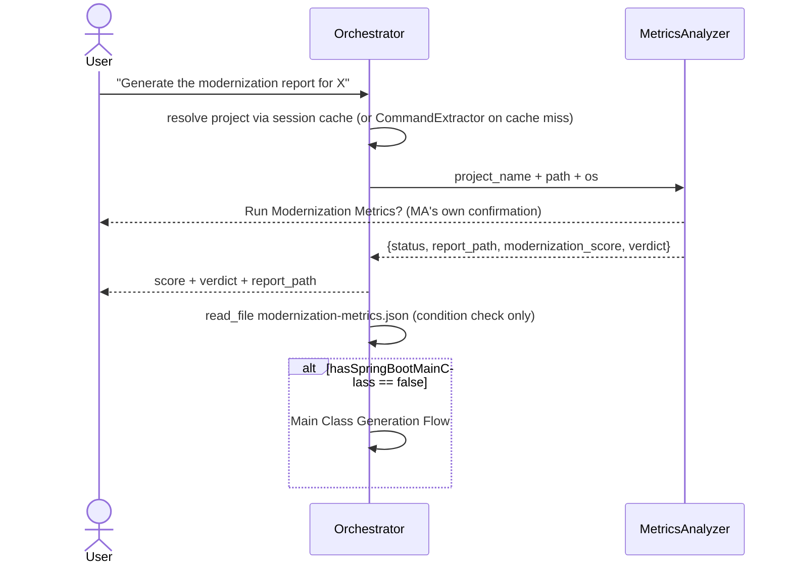
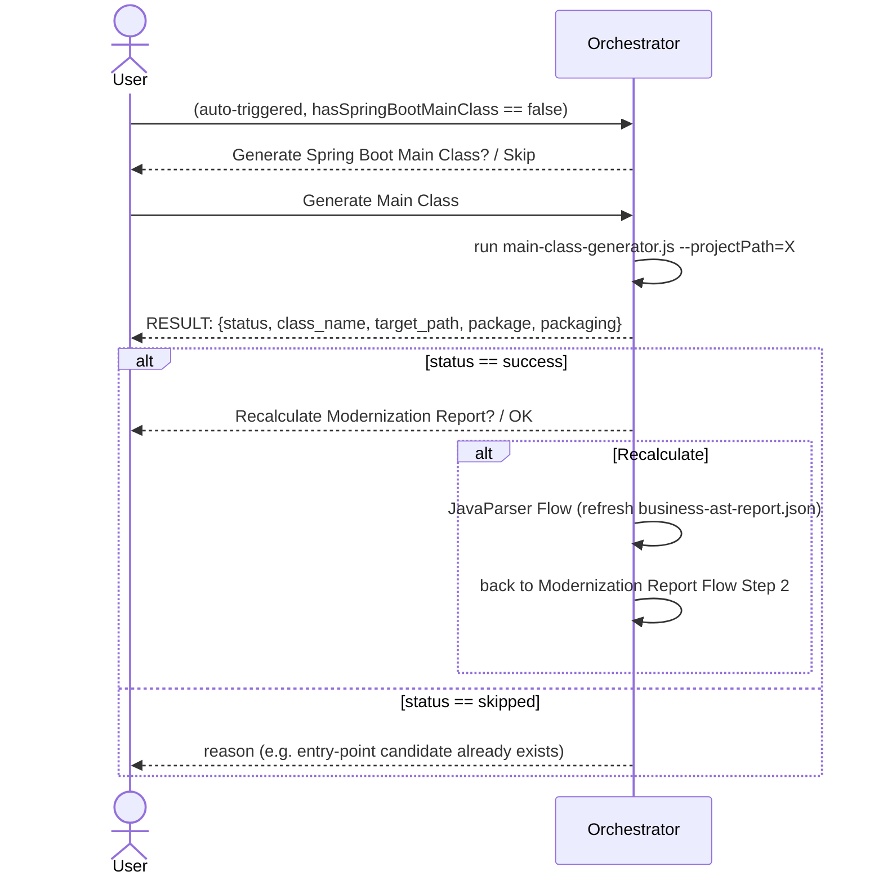

## Report Flow (migration analysis / inspect / scan / Java 21 / Spring Boot 3)

Triggered when the user asks for a migration report or inspection of a Java project — produces pre-migration findings.

`report_path` is `MIGRATION_PLAN.md` (both skills active), or the legacy per-skill filename (`JAVA21_REFACTORING_PLAN.md` / `SPRINGBOOT3_MIGRATION_PLAN.md`) when only one is active. *Apply Changes* jumps straight into the Refactoring Flow.

---

## Modernization Report Flow (post-migration score / metrics)

Triggered when the user asks to generate/score the modernization report — distinct from Report Flow: this computes a numeric score from already-generated `business-ast-report.json` + `dependency-tree.txt`, it does not scan source for findings.

`modernization_score` is 0–100; `verdict` is `LEGACY` (<40) / `IN_MODERNIZATION` (40–69) / `MODERN` (≥70). A missing Spring Boot entry point applies a flat 15-point penalty on top of the annotation-density/framework-version/legacy-debt components.

---

## Main Class Generation Flow (missing `@SpringBootApplication` entry point)

Triggered only from Modernization Report Flow, never directly by the user.

The tool resolves the root package (shortest common package prefix across all classes), the class name (`PascalCase(artifactId) + "Application"`), and the `jar`/`war` template from `pom.xml`/`build.gradle` — per the `spring-boot-main-class` skill rules.
