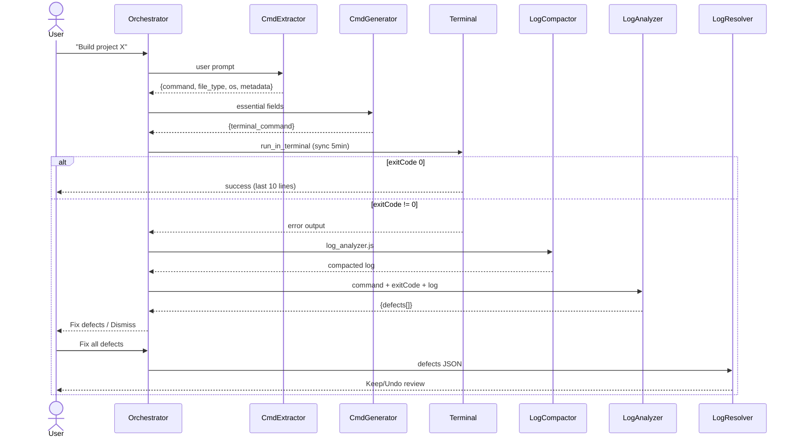
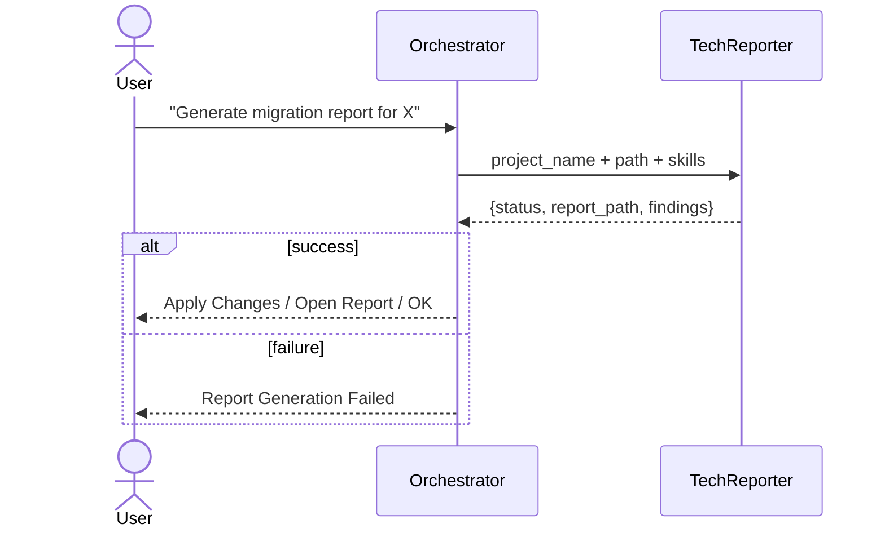
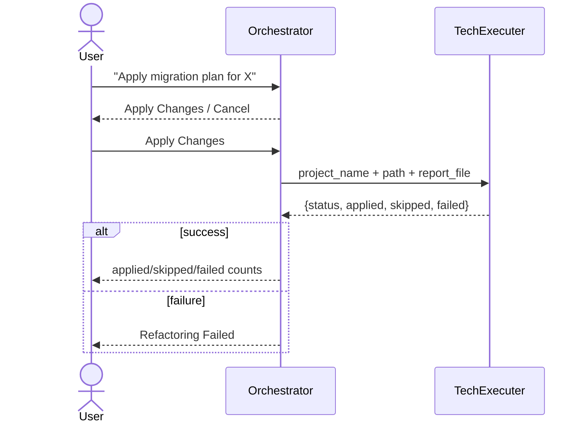
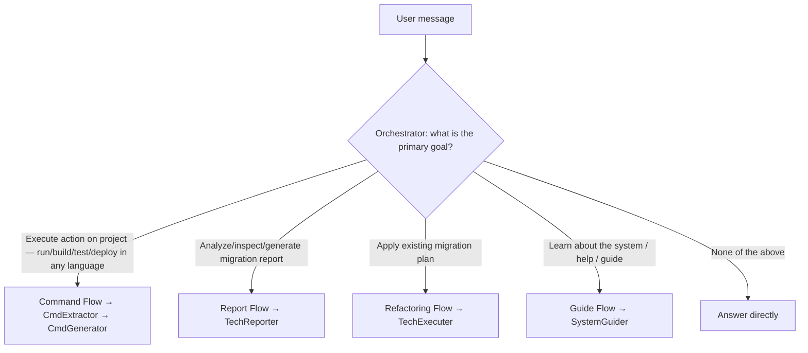

## Section Index

| Section | Approx. lines |
|---|---|
| Agent Catalog | 15–26 |
| Workflows | 28–110 |
| Example Invocation Payloads | 112–123 |
| Answering Common Questions | 125–end |

## Agent Catalog

| Agent | Role | Invoked by |
|---|---|---|
| **Orchestrator** | Sole user-facing entry point. Routes all requests. Never handles specialized logic itself. | User (directly) |
| **CommandExtractor** | Reads the project build file; extracts `file_type`, `os`, `hasMavenWrapper`, and version metadata. Returns structured JSON. | Orchestrator — Command Flow |
| **CommandGenerator** | Receives CommandExtractor JSON, loads the matching skill file, returns the exact terminal command + confirmation metadata. | Orchestrator — Command Flow |
| **LogAnalyzer** | Receives filtered error logs. Returns a structured JSON defect list (severity, category, coordinates). Never proposes fixes. | Orchestrator — Command Flow (on failure) |
| **LogResolver** | Receives LogAnalyzer's defect list. Groups defects by file, applies minimal fixes in a single batch pass, prompts user with a multi-select Keep/Undo review. | Orchestrator — after user confirms *Fix all defects* |
| **TechnicalReporter** | Read-only migration analyst. Scans a Java project, generates `MIGRATION_PLAN.md`, and immediately runs `apply-plan.js`. | Orchestrator — Report Flow |
| **TechnicalExecuter** | Execution wrapper only. Receives a `MIGRATION_PLAN.md` path and runs `apply-plan.js`. No analysis. | Orchestrator — Refactoring Flow |
| **SystemGuider** *(this agent)* | Explains the system, renders diagrams, and generates example payloads. Read-only. | Orchestrator — Guide Flow |

## Workflows

### 1 — Command Flow (build / test / run / package / compile / deploy)

Triggered when the user asks to build, test, run, or package a named project.

### 2 — Report Flow (migration analysis / inspect / scan / Java 21 / Spring Boot 3)

Triggered when the user asks for a migration report or inspection of a Java project.

### 3 — Refactoring Flow (apply the plan / implement changes)

Triggered when the user asks to apply a previously generated migration plan.

### 4 — Orchestrator Decision Routing

## Example Invocation Payloads

Paste any of these directly into the Orchestrator:

| Intent | Payload |
|---|---|
| Run tests | `Run the tests for project my-spring-app` |
| Build | `Build project my-gradle-service` |
| Migration report | `Generate a migration report for project Proyecto-java-8-legacy` |
| Apply plan | `Apply the migration plan for project Proyecto-java-8-legacy` |
| OpenRewrite | `Apply openReWrite for project my-spring-app` |
| Package | `Package project my-service` |
| Get help | `How does this multi-agent system work?` |

## Answering Common Questions

| User asks | Respond with |
|---|---|
| "What agents exist?" | Agent Catalog table |
| "How does the build flow work?" | Workflow 1 diagram + brief prose |
| "What happens when a build fails?" | Steps 4–7 of Command Flow; show sequence diagram |
| "How do I migrate to Java 21?" | Report Flow + Refactoring Flow + example payloads |
| "Can I invoke an agent directly?" | Only the Orchestrator is user-invocable; all others are internal |
| "What triggers SystemGuider?" | Guide Flow routing row in the Orchestrator |
