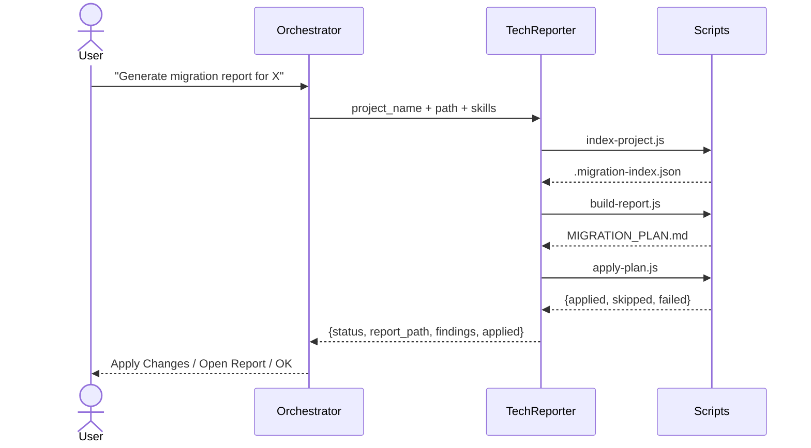
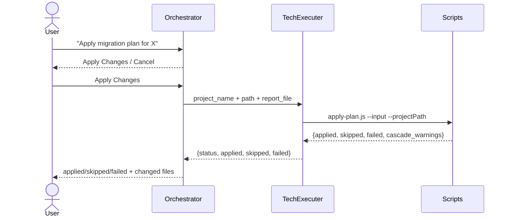

## What Is the Migration Plan?

`MIGRATION_PLAN.md` (and its skill-specific variants) is a structured report generated by **TechnicalReporter** that captures every modernization finding in the project. It serves two purposes:

1. **Human review** — shows file, line, current code, proposed replacement, effort, and risk for each finding.
2. **Automated patching input** — `apply-plan.js` reads the file and rewrites the project source directly.

The report is stored in the **project root** alongside the source code.

### Report Filename Convention

The filename depends on which migration skills were active during analysis:

| Active skill(s) | Output filename |
|---|---|
| Java 21 only | `JAVA21_REFACTORING_PLAN.md` |
| Spring Boot 3 only | `SPRINGBOOT3_MIGRATION_PLAN.md` |
| Both Java 21 + Spring Boot 3 | `MIGRATION_PLAN.md` |

---

## How the Plan Is Generated — TechnicalReporter (6 steps)

**TechnicalReporter** scans the project, generates the report, and immediately applies it — all in one turn. Invoked by the Orchestrator during the **Report Flow**.

### Generation + Application Diagram

---

## How the Plan Is Applied — Two Paths

### Path A — Inline (default, no extra step)

TechnicalReporter runs `apply-plan.js` in **Step 6 of its own turn**. The report is generated and applied atomically. The Orchestrator receives a single JSON result with both analysis and application counts.

### Path B — Standalone via TechnicalExecuter

If the plan already exists from a previous session, the Orchestrator can invoke **TechnicalExecuter** directly with only the report path. TechnicalExecuter runs a single `apply-plan.js` call and returns immediately — it does no analysis of its own.

---

## What `apply-plan.js` Does

`apply-plan.js` patches each source file listed in the plan and returns a JSON result on stdout:

| Field | Meaning |
|---|---|
| `status` | `success` (0 skipped/failed) · `partial` (some skipped/failed) · `failure` |
| `applied` | Findings written successfully |
| `skipped` | Target line no longer matched (already migrated) |
| `failed` | Error during write |
| `cascade_warnings` | Changes that may require a follow-up edit elsewhere |

---

## Answering Common Questions

| User asks | Respond with |
|---|---|
| "How do I generate a migration plan?" | Trigger the Report Flow: *"Generate a migration report for project X"* |
| "How do I apply the migration plan?" | Trigger the Refactoring Flow: *"Apply the migration plan for project X"* |
| "What's the difference between MIGRATION_PLAN.md and JAVA21_REFACTORING_PLAN.md?" | Filename depends on active skills — see Report Filename Convention table above |
| "Does TechnicalReporter apply the changes automatically?" | Yes — it runs `apply-plan.js` inline in Step 6 of its own turn |
| "When do I need TechnicalExecuter?" | Only when the plan already exists and you want to re-apply it without re-scanning |
| "What happens if some findings are skipped?" | `status` becomes `"partial"` — `skipped` count is > 0; re-run or review manually |
| "Where is the plan file saved?" | Project root (same folder as `pom.xml` or `build.gradle`) |
| "Can I review the plan before it is applied?" | Yes — choose *Open Report* in the Orchestrator prompt after generation |
