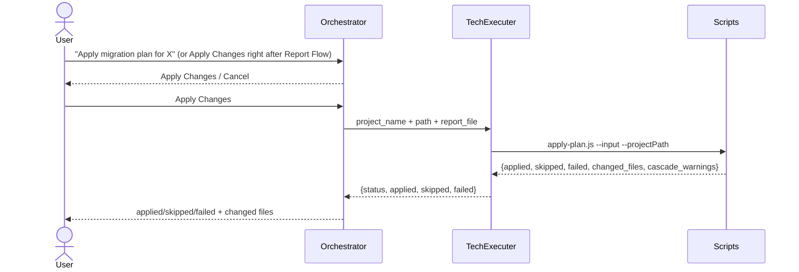

## How the Plan Is Applied — TechnicalExecuter (the only path)

TechnicalExecuter is a pure execution wrapper: it reads no project files itself and runs exactly one terminal call.

This is the single application path whether the plan was just generated or already existed from a previous session — TechnicalExecuter never re-scans the project. For how the plan gets generated in the first place, load [system-guide-migration-plan-technical-reporter](.github/skills/system-guide-migration-plan-technical-reporter/SKILL.md) on its own turn.

## What `apply-plan.js` Does

`apply-plan.js` patches each source file listed in the plan and returns a JSON result on stdout:

| Field | Meaning |
|---|---|
| `status` | `success` (0 skipped/failed) · `partial` (some skipped/failed) · `failure` |
| `applied` | Findings written successfully |
| `skipped` | Target line no longer matched (already migrated) |
| `failed` | Error during write |
| `cascade_warnings` | Changes that may require a follow-up edit elsewhere |
