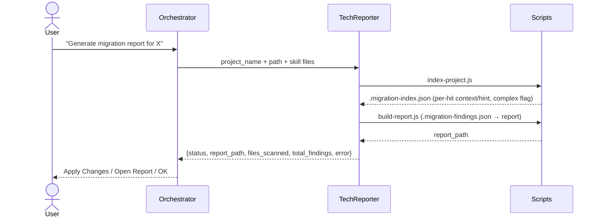

## How the Plan Is Generated — TechnicalReporter

**TechnicalReporter** indexes the project off-thread, inspects only the hits that need full-file context, and renders the report — all read-only, no source patching. Invoked by the Orchestrator during the **Report Flow**.

### Generation Diagram

`Apply Changes` does not re-run any TechnicalReporter logic — it jumps straight into the Refactoring Flow, passing `project_name` + `report_path`. For how that application step works, load [system-guide-migration-plan-technical-executer](.github/skills/system-guide-migration-plan-technical-executer/SKILL.md) on its own turn.
